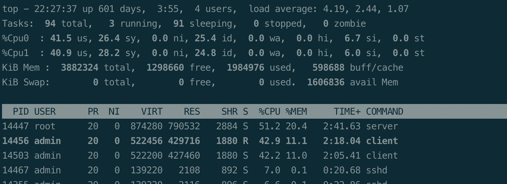

# QueueService

### 一、服务器框架解析

    1.每一个tcp链接会启动一个Session的 goroutine，每个Session启动分别 recvMsg 和 sendMsg goroutine
    2.recvMsg 的 goroutine 用于解析客户端发过来的消息，并进行协议转发至处理对应协议的handler
    3.sendMsg 的 goroutine 监听 chan sendMsgChan，用于将协议直接发送给客户端
    4.recvMsg 设置 5秒 的读超时, sendMsg 设置 2秒 的写超时，超时则自动关闭连接。依赖客户端发送那个心跳消息保活
    5.采用客户端加入队列时间戳进行排序，重复加入已最新时间为准，使用uuid模拟userId保证唯一性
    6.支持实时调整客户端排队顺序，+n秒/-n秒
    7.客户端定时发送心跳和查询排位实时位置。频率可通过变量 Clint.startProduct 定时器进行调整
    8.服务信号安全，监听到关闭信号后启动关闭流程
        
#### 队列算法解析

    1.队列使用 sortedset 结构进行维护，可以实时查询和调整 玩家 的排队位置
    2.可以灵活调整玩家的队列顺序。适用于VIP玩家的特权功能的实现

#### 协议

    ------------------------------
    |           Header    | Body |
    | BodyLen=4 | MsgId=4 |      |
    ------------------------------
    
#### 启动参数

##### 服务器
 
    -addr   启动地址
    -port   启动端口
    -capSize 系统容量(当容量达到上限，对于请求排队的客户端会发送队列满消息,断开连接)

##### 客户端
    -addr  服务地址
    -port  服务端口

##### 客户端生产者 
    -customer  生产者 false
    -num   启动客户端数量(消费者，自动发送排队申请消息，定时查询排队位置信息和心跳消息，出队后自动关闭)
    
##### 客户端消费者
    -customer  消费者 true
    -consumSpeed 消费速率，每秒消费的数量

##### 客户端管理员
    -priority 调整优先级 true
    -prioritySecs 调整优先级秒数(支持负值)
    -priorityUserId 调整优先级的用户ID

#### 编译和运行

    ./build.sh
    ./server
    ./client -num 100
    ./client -consumSpeed 1 -customer true
    ./client -priorityUserId 123456 -prioritySecs 1 -priority true

#### 测试机器
    
    阿里云
    处理器 2核    Intel(R) Xeon(R) Platinum 8163 CPU @ 2.50GHz
    内存 4G 
    
#### 测试样本

    客户端排队并发量10000

#### cpu && mem 消耗

#### cpu && mem占用分析
详见 img/cpu.svg, img/alloc.svg

### 四、已解决问题

    1.应用层协议粘包问题
    2.客户端心跳超时、读写超时
    
### 五、TODO

    1.使用协程池优化
    2.测试数据的完善 rtt，qps等
    3.优化网络消息，使用protobuf组包和解包
    4.通过前置网关进行接入，使用rpc进行通信，优化连接数量
    5.服务器的监控及其熔断恢复处理
    6.日志系统接入
    7.metrics接入
    8.每个客户端有两个buff: network.Session.sendMsgChan 和 network.Session.buf，经测试占用比较大内存，待优化